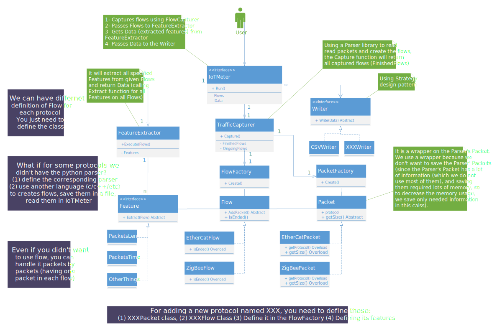

# ZwaveNetLyzer
Z-Wave Network Traffic Analyzer

# Table of Contents

- [ZwaveNetLyzer](#zwavenetlyzer)
- [Table of Contents](#table-of-contents)
- [Installation](#installation)
- [Execution](#execution)
- [Architecture](#architecture)
- [Extracted Features](#extracted-features)
- [Citation and Copywrite (c) 2024](#Citation-&-Copyright-(c)-2024)
- [Contributing](#contributing)
- [Project Team members](#project-team-members)

# Installation

Before installing or running the NTLFlowLyzer package, it's essential to set up the necessary requirements on your system. Begin by ensuring you have both `Python` and `pip` installed and functioning properly (execute the `pip3 --version` command). Then, execute the following command:

```bash
pip3 install -r requirements.txt
```

You are prepared to install NTLFlowLyzer. To proceed, execute the following command in the package's root directory (where the setup.py file is located), which will install the NTLFlowLyzer package on your system:

### On Linux:
```bash
python3 setup.py install
```

### On Windows:
```bash
pip3 install .
```

After successfully installing the package, confirm the installation by running the following command:

```bash
ntlflowlyzer --version
```


# Execution

The core aspect of running NTLFlowLyzer involves preparing the configuration file. This file is designed to facilitate users in customizing the program's behavior with minimal complexity and cost, thus enhancing program scalability. Below, we outline how to prepare the configuration file and subsequently demonstrate how to execute NTLFlowLyzer using it.


## Argument Parser

You can use `-h` to see different options of the program.

To execute NTLFlowLyzer, simply run the following command:

```bash
ntlflowlyzer -c YOUR_CONFIG_FILE
```

Replace `YOUR_CONFIG_FILE` with the path to your configuration file.


Moreover, this project has been successfully tested on Ubuntu 20.04, Ubuntu 22.04, Windows 10, and Windows 11. It should work on other versions of Ubuntu OS (or even Debian OS) as long as your system has the necessary Python3 packages (you can find the required packages listed in the `requirements.txt` file).


# Architecture




                
----

# Extracted Features

We currently have 401 features that are as follows (features' explanation will be added):

1. Flow ID
1. TimeStamp
1. Protocol
1. ZwaveFlowHomeID
1. ZwaveFlowSrcID
1. ZwaveFlowDstID
1. Duration
1. PacketsCount
1. AverageSpeed
1. MedianSpeed
1. ModeSpeed
1. StdDevSpeed
1. MinSpeed
1. MaxSpeed
1. SpeedRange
1. SpeedVariance
1. CoeffVariationSpeed
1. SpeedSkewness
1. FwdAverageSpeed
1. FwdMedianSpeed
1. FwdModeSpeed
1. FwdStdDevSpeed
1. FwdMinSpeed
1. FwdMaxSpeed
1. FwdSpeedRange
1. FwdSpeedVariance
1. FwdCoeffVariationSpeed
1. FwdSpeedSkewness
1. BwdAverageSpeed
1. BwdMedianSpeed
1. BwdModeSpeed
1. BwdStdDevSpeed
1. BwdMinSpeed
1. BwdMaxSpeed
1. BwdSpeedRange
1. BwdSpeedVariance
1. BwdCoeffVariationSpeed
1. BwdSpeedSkewness
1. CountEachPacketClass
1. ProportionEachPacketClass
1. ProportionEachApplicationType
1. FwdCountEachPacketClass
1. FwdProportionEachPacketClass
1. FwdProportionEachApplicationType
1. BwdCountEachPacketClass
1. BwdProportionEachPacketClass
1. BwdProportionEachApplicationType
1. AverageRSSI
1. MedianRSSI
1. ModeRSSI
1. StdDevRSSI
1. MinRSSI
1. MaxRSSI
1. RSSIRange
1. RSSIVariance
1. CoeffVariationSpeed
1. RSSISkewness
1. RSSIKurtosis
1. FwdAverageRSSI
1. FwdMedianRSSI
1. FwdModeRSSI
1. FwdStdDevRSSI
1. FwdMinRSSI
1. FwdMaxRSSI
1. FwdRSSIRange
1. FwdRSSIVariance
1. FwdCoeffVariationSpeed
1. FwdRSSISkewness
1. FwdRSSIKurtosis
1. BwdAverageRSSI
1. BwdMedianRSSI
1. BwdModeRSSI
1. BwdStdDevRSSI
1. BwdMinRSSI
1. BwdMaxRSSI
1. BwdRSSIRange
1. BwdRSSIVariance
1. BwdCoeffVariationSpeed
1. BwdRSSISkewness
1. BwdRSSIKurtosis
1. TotalAcknowledgments
1. ProportionAcknowledgedPackets
1. TotalCRCErrors
1. ProportionCRCErrors
1. TotalSubstitutedPackets
1. ProportionSubstitutedPackets
1. CountPacketsWithUnknownHeaders
1. ProportionUnknownHeaderPackets
1. CountWakeupBeams
1. ProportionWakeupBeamPackets
1. UniqueHexPatternsCount
1. FrequencyOfTopHexPatterns
1. EntropyOfHexData
1. HexDataPatternLengthVariability
1. CrossCorrelationSpeedRSSI
1. TimeSeriesAnalysisPacketIntervals
1. PercentagePacketsPerChannel
1. PercentageHighSpeedTransmissions
1. TotalLowSignalPackets
1. PercentageLowSignalPackets
1. AverageChannelUsage
1. MostCommonChannel
1. LeastCommonChannel
1. ChannelTransitionCount
1. ChannelStability
1. EntropyOfChannelUsage
1. CommonDataPatterns
1. UniqueDataEntries
1. ClassDistribution
1. MostCommonClass
1. LeastCommonClass
1. ApplicationUsageFrequency
1. MostCommonApplication
1. UniqueApplicationCount
1. HeaderPatternConsistency
1. HeaderComplexity
1. PayloadToHeaderRatio
1. IncrementalDataChange
1. HeaderEntropy
1. TemporalStabilityOfClassType
1. TemporalStabilityOfApplicationType
1. DataFieldEntropy
1. PayloadEntropy
1. CountOfSingleCastPackets
1. ProportionOfSingleCastPackets
1. CountOfACKPackets
1. ProportionOfACKPackets
1. CountOfMulticastPackets
1. ProportionOfMulticastPackets
1. CountOfBroadcastPackets
1. ProportionOfBroadcastPackets
1. CountOfExplorerAutoInclusionPackets
1. ProportionOfExplorerAutoInclusionPackets
1. FwdTotalAcknowledgments
1. FwdProportionAcknowledgedPackets
1. FwdTotalCRCErrors
1. FwdProportionCRCErrors
1. FwdTotalSubstitutedPackets
1. FwdProportionSubstitutedPackets
1. FwdCountPacketsWithUnknownHeaders
1. FwdProportionUnknownHeaderPackets
1. FwdCountWakeupBeams
1. FwdProportionWakeupBeamPackets
1. FwdUniqueHexPatternsCount
1. FwdFrequencyOfTopHexPatterns
1. FwdEntropyOfHexData
1. FwdHexDataPatternLengthVariability
1. FwdCrossCorrelationSpeedRSSI
1. FwdTimeSeriesAnalysisPacketIntervals
1. FwdPercentagePacketsPerChannel
1. FwdPercentageHighSpeedTransmissions
1. FwdTotalLowSignalPackets
1. FwdPercentageLowSignalPackets
1. FwdAverageChannelUsage
1. FwdMostCommonChannel
1. FwdLeastCommonChannel
1. FwdChannelTransitionCount
1. FwdChannelStability
1. FwdEntropyOfChannelUsage
1. FwdCommonDataPatterns
1. FwdUniqueDataEntries
1. FwdClassDistribution
1. FwdMostCommonClass
1. FwdLeastCommonClass
1. FwdApplicationUsageFrequency
1. FwdMostCommonApplication
1. FwdUniqueApplicationCount
1. FwdHeaderPatternConsistency
1. FwdHeaderComplexity
1. FwdPayloadToHeaderRatio
1. FwdIncrementalDataChange
1. FwdHeaderEntropy
1. FwdTemporalStabilityOfClassType
1. FwdTemporalStabilityOfApplicationType
1. FwdDataFieldEntropy
1. FwdPayloadEntropy
1. FwdCountOfSingleCastPackets
1. FwdProportionOfSingleCastPackets
1. FwdCountOfACKPackets
1. FwdProportionOfACKPackets
1. FwdCountOfMulticastPackets
1. FwdProportionOfMulticastPackets
1. FwdCountOfBroadcastPackets
1. FwdProportionOfBroadcastPackets
1. FwdCountOfExplorerAutoInclusionPackets
1. FwdProportionOfExplorerAutoInclusionPackets
1. BwdTotalAcknowledgments
1. BwdProportionAcknowledgedPackets
1. BwdTotalCRCErrors
1. BwdProportionCRCErrors
1. BwdTotalSubstitutedPackets
1. BwdProportionSubstitutedPackets
1. BwdCountPacketsWithUnknownHeaders
1. BwdProportionUnknownHeaderPackets
1. BwdCountWakeupBeams
1. BwdProportionWakeupBeamPackets
1. BwdUniqueHexPatternsCount
1. BwdFrequencyOfTopHexPatterns
1. BwdEntropyOfHexData 
1. BwdHexDataPatternLengthVariability
1. BwdCrossCorrelationSpeedRSSI
1. BwdTimeSeriesAnalysisPacketIntervals
1. BwdPercentagePacketsPerChannel
1. BwdPercentageHighSpeedTransmissions
1. BwdTotalLowSignalPackets
1. BwdPercentageLowSignalPackets
1. BwdAverageChannelUsage
1. BwdMostCommonChannel
1. BwdLeastCommonChannel
1. BwdChannelTransitionCount
1. BwdChannelStability
1. BwdEntropyOfChannelUsage
1. BwdCommonDataPatterns
1. BwdUniqueDataEntries
1. BwdClassDistribution
1. BwdMostCommonClass
1. BwdLeastCommonClass
1. BwdApplicationUsageFrequency
1. BwdMostCommonApplication
1. BwdUniqueApplicationCount
1. BwdHeaderPatternConsistency
1. BwdHeaderComplexity
1. BwdPayloadToHeaderRatio
1. BwdIncrementalDataChange
1. BwdHeaderEntropy
1. BwdTemporalStabilityOfClassType
1. BwdTemporalStabilityOfApplicationType
1. BwdDataFieldEntropy
1. BwdPayloadEntropy
1. BwdCountOfSingleCastPackets
1. BwdProportionOfSingleCastPackets
1. BwdCountOfACKPackets
1. BwdProportionOfACKPackets
1. BwdCountOfMulticastPackets
1. BwdProportionOfMulticastPackets
1. BwdCountOfBroadcastPackets
1. BwdProportionOfBroadcastPackets
1. BwdCountOfExplorerAutoInclusionPackets
1. BwdProportionOfExplorerAutoInclusionPackets
1. TotalHeaderBytes
1. MaxHeaderBytes
1. MinHeaderBytes
1. MeanHeaderBytes
1. ModeHeaderBytes
1. VarianceHeaderBytes
1. StandardDeviationHeaderBytes
1. MedianHeaderBytes
1. SkewnessHeaderBytes
1. CoefficientOfVariationHeaderBytes
1. MaxPayloadBytes
1. TotalPayloadBytes
1. MinPayloadBytes
1. MeanPayloadBytes
1. ModePayloadBytes
1. VariancePayloadBytes
1. StandardDeviationPayloadBytes
1. MedianPayloadBytes
1. SkewnessPayloadBytes
1. CoefficientOfVariationPayloadBytes
1. TotalPacketLen
1. MaxPacketLen
1. MinPacketLen
1. MeanPacketLen
1. ModePacketLen
1. VariancePacketLen
1. StandardDeviationPacketLen
1. MedianPacketLen
1. SkewnessPacketLen
1. CoefficientOfVariationPacketLen
1. TotalDataFieldSize
1. MaxDataFieldSize
1. MinDataFieldSize
1. MeanDataFieldSize
1. ModeDataFieldSize
1. VarianceDataFieldSize
1. StdDataFieldSize
1. SkewnessDataFieldSize
1. CoefficientOfVariationDataFieldSize
1. MedianDataFieldSize
1. FwdTotalHeaderBytes
1. FwdMaxHeaderBytes
1. FwdMinHeaderBytes
1. FwdMeanHeaderBytes
1. FwdModeHeaderBytes
1. FwdVarianceHeaderBytes
1. FwdStandardDeviationHeaderBytes
1. FwdMedianHeaderBytes
1. FwdSkewnessHeaderBytes
1. FwdCoefficientOfVariationHeaderBytes
1. FwdMaxPayloadBytes
1. FwdTotalPayloadBytes
1. FwdMinPayloadBytes
1. FwdMeanPayloadBytes
1. FwdModePayloadBytes
1. FwdVariancePayloadBytes
1. FwdStandardDeviationPayloadBytes
1. FwdMedianPayloadBytes
1. FwdSkewnessPayloadBytes
1. FwdCoefficientOfVariationPayloadBytes
1. FwdTotalPacketLen
1. FwdMaxPacketLen
1. FwdMinPacketLen
1. FwdMeanPacketLen
1. FwdModePacketLen
1. FwdVariancePacketLen
1. FwdStandardDeviationPacketLen
1. FwdMedianPacketLen
1. FwdSkewnessPacketLen
1. FwdCoefficientOfVariationPacketLen
1. FwdTotalDataFieldSize
1. FwdMaxDataFieldSize
1. FwdMinDataFieldSize
1. FwdMeanDataFieldSize
1. FwdModeDataFieldSize
1. FwdVarianceDataFieldSize
1. FwdStdDataFieldSize
1. FwdSkewnessDataFieldSize
1. FwdCoefficientOfVariationDataFieldSize
1. FwdMedianDataFieldSize
1. BwdTotalHeaderBytes
1. BwdMaxHeaderBytes
1. BwdMinHeaderBytes
1. BwdMeanHeaderBytes
1. BwdModeHeaderBytes
1. BwdVarianceHeaderBytes
1. BwdStandardDeviationHeaderBytes
1. BwdMedianHeaderBytes
1. BwdSkewnessHeaderBytes
1. BwdCoefficientOfVariationHeaderBytes
1. BwdMaxPayloadBytes
1. BwdTotalPayloadBytes
1. BwdMinPayloadBytes
1. BwdMeanPayloadBytes
1. BwdModePayloadBytes
1. BwdVariancePayloadBytes
1. BwdStandardDeviationPayloadBytes
1. BwdMedianPayloadBytes
1. BwdSkewnessPayloadBytes
1. BwdCoefficientOfVariationPayloadBytes
1. BwdTotalPacketLen
1. BwdMaxPacketLen
1. BwdMinPacketLen
1. BwdMeanPacketLen
1. BwdModePacketLen
1. BwdVariancePacketLen
1. BwdStandardDeviationPacketLen
1. BwdMedianPacketLen
1. BwdSkewnessPacketLen
1. BwdCoefficientOfVariationPacketLen
1. BwdTotalDataFieldSize
1. BwdMaxDataFieldSize
1. BwdMinDataFieldSize
1. BwdMeanDataFieldSize
1. BwdModeDataFieldSize
1. BwdVarianceDataFieldSize
1. BwdStdDataFieldSize
1. BwdSkewnessDataFieldSize
1. BwdCoefficientOfVariationDataFieldSize
1. BwdMedianDataFieldSize
1. HeaderBytesRate
1. PayloadBytesRate
1. PacketLenRate
1. PacketsRate
1. FwdPacketsCount
1. FwdHeaderBytesRate
1. FwdPayloadBytesRate
1. FwdPacketLenRate
1. FwdPacketsRate
1. BwdPacketsCount
1. BwdHeaderBytesRate
1. BwdPayloadBytesRate
1. BwdPacketLenRate
1. BwdPacketsRate
1. MaxPacketsTimeDelta
1. MinPacketsTimeDelta
1. MeanPacketsTimeDelta
1. ModePacketsTimeDelta
1. VariancePacketsTimeDelta
1. StandardDeviationPacketsTimeDelta
1. MedianPacketsTimeDelta
1. SkewnessPacketsTimeDelta
1. CoefficientOfVariationPacketsTimeDelta
1. FwdMaxPacketsTimeDelta
1. FwdMinPacketsTimeDelta
1. FwdMeanPacketsTimeDelta
1. FwdModePacketsTimeDelta
1. FwdVariancePacketsTimeDelta
1. FwdStandardDeviationPacketsTimeDelta
1. FwdMedianPacketsTimeDelta
1. FwdSkewnessPacketsTimeDelta
1. FwdCoefficientOfVariationPacketsTimeDelta
1. BwdMaxPacketsTimeDelta
1. BwdMinPacketsTimeDelta
1. BwdMeanPacketsTimeDelta
1. BwdModePacketsTimeDelta
1. BwdVariancePacketsTimeDelta
1. BwdStandardDeviationPacketsTimeDelta
1. BwdMedianPacketsTimeDelta
1. BwdSkewnessPacketsTimeDelta
1. BwdCoefficientOfVariationPacketsTimeDelta
1. Label

# Citation & Copywrite (c) 2024  (#Citation-&-Copyright-(c)-2024)

For citation in your works and also understanding ZwaveNetLyzer completely, you can find below published papers:
```
TO BE UPDATED
```

# Project Team members 

* [**Arash Habibi Lashkari:**](http://ahlashkari.com/index.asp) Founder and supervisor
* [**Moein Shafi:**](https://github.com/moein-shafi) Graduate student, Researcher and Developer


# Contributing

Any contribution is welcome in the form of pull requests.

