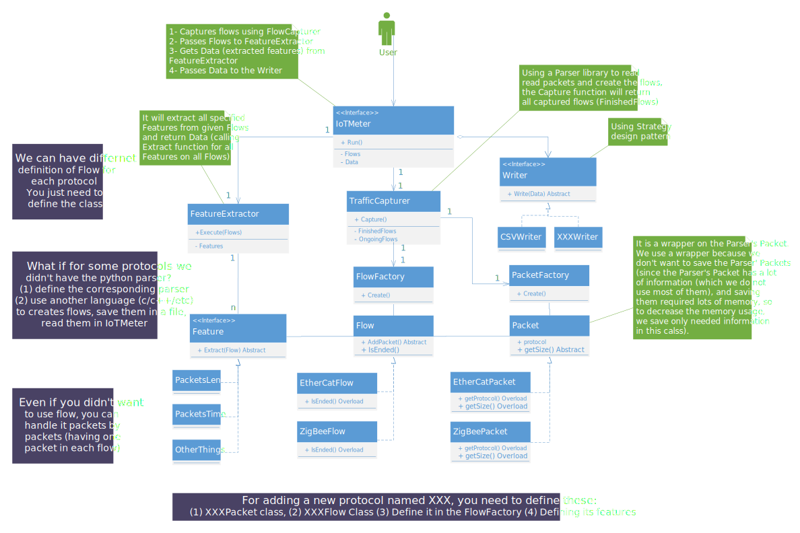
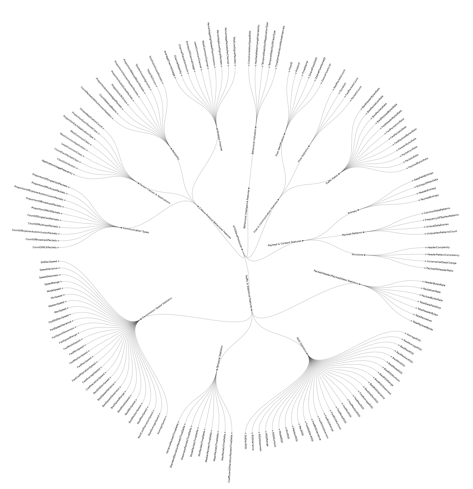

# IoT-ZwaveNetLyzer
IoT-ZwaveNetLyzer is an open-source Python project developed for analyzing Z-Wave network traffic in IoT environments. It generates bidirectional traffic flows and extracts over 400 statistical and protocol-level features, such as signal strength (RSSI), packet speed, acknowledgment ratios, and channel usage patterns. By profiling both forward and backward communication streams, it enables a fine-grained understanding of device behavior and communication efficiency across smart home and industrial IoT networks.

Designed for scalability and transparency, IoT-ZwaveNetLyzer supports both Linux and Windows environments and can be customized through simple configuration files, enabling flexible use in research and experimentation. The analyzer is a crucial tool for building and validating IoT intrusion detection systems, providing a structured framework to characterize device behavior, network stability, and traffic anomalies in both real and simulated environments.

# Table of Contents

- [IoT-ZwaveNetLyzer](#zwavenetlyzer)
- [Table of Contents](#table-of-contents)
- [Installation](#installation)
- [Execution](#execution)
- [Architecture](#architecture)
- [Extracted Features](#extracted-features)
- [Citation and Copywrite (c) 2024](#Citation-&-Copyright-(c)-2024)
- [Contributing](#contributing)
- [Project Team members](#project-team-members)

# Installation

Before installing or running the ZwaveNetLyzer package, it's essential to set up the necessary requirements on your system. Begin by ensuring you have both `Python` and `pip` installed and functioning properly (execute the `pip3 --version` command). Then, execute the following command:

```bash
pip3 install -r requirements.txt
```

You are prepared to install ZwaveNetLyzer. To proceed, execute the following command in the package's root directory (where the setup.py file is located), which will install the ZwaveNetLyzer package on your system:

### On Linux:
```bash
python3 setup.py install
```

### On Windows:
```bash
pip3 install .
```

After successfully installing the package, confirm the installation by running the following command:

```bash
zwave-netlyzer --version
```


# Execution

The core aspect of running ZwaveNetLyzer involves preparing the configuration file. This file is designed to facilitate users in customizing the program's behavior with minimal complexity and cost, thus enhancing program scalability. Below, we outline how to prepare the configuration file and subsequently demonstrate how to execute ZwaveNetLyzer using it.


## Argument Parser

You can use `-h` to see different options of the program.

To execute ZwaveNetLyzer, simply run the following command:

```bash
zwave-netlyzer -c YOUR_CONFIG_FILE
```

Replace `YOUR_CONFIG_FILE` with the path to your configuration file.


Moreover, this project has been successfully tested on Ubuntu 20.04, Ubuntu 22.04, Windows 10, and Windows 11. It should work on other versions of Ubuntu OS (or even Debian OS) as long as your system has the necessary Python3 packages (you can find the required packages listed in the `requirements.txt` file).


# Architecture




                
----

# Extracted Features

We currently have 401 features that are as follows (features' explanation will be added):




1. Flow ID
2. TimeStamp
3. Protocol
4. ZwaveFlowHomeID
5. ZwaveFlowSrcID
6. ZwaveFlowDstID
7. Duration
8. PacketsCount
9. AverageSpeed
10. MedianSpeed
11. ModeSpeed
12. StdDevSpeed
13. MinSpeed
14. MaxSpeed
15. SpeedRange
16. SpeedVariance
17. CoeffVariationSpeed
18. SpeedSkewness
19. FwdAverageSpeed
20. FwdMedianSpeed
21. FwdModeSpeed
22. FwdStdDevSpeed
23. FwdMinSpeed
24. FwdMaxSpeed
25. FwdSpeedRange
26. FwdSpeedVariance
27. FwdCoeffVariationSpeed
28. FwdSpeedSkewness
29. BwdAverageSpeed
30. BwdMedianSpeed
31. BwdModeSpeed
32. BwdStdDevSpeed
33. BwdMinSpeed
34. BwdMaxSpeed
35. BwdSpeedRange
36. BwdSpeedVariance
37. BwdCoeffVariationSpeed
38. BwdSpeedSkewness
39. CountEachPacketClass
40. ProportionEachPacketClass
41. ProportionEachApplicationType
42. FwdCountEachPacketClass
43. FwdProportionEachPacketClass
44. FwdProportionEachApplicationType
45. BwdCountEachPacketClass
46. BwdProportionEachPacketClass
47. BwdProportionEachApplicationType
48. AverageRSSI
49. MedianRSSI
50. ModeRSSI
51. StdDevRSSI
52. MinRSSI
53. MaxRSSI
54. RSSIRange
55. RSSIVariance
56. CoeffVariationSpeed
57. RSSISkewness
58. RSSIKurtosis
59. FwdAverageRSSI
60. FwdMedianRSSI
61. FwdModeRSSI
62. FwdStdDevRSSI
63. FwdMinRSSI
64. FwdMaxRSSI
65. FwdRSSIRange
66. FwdRSSIVariance
67. FwdCoeffVariationSpeed
68. FwdRSSISkewness
69. FwdRSSIKurtosis
70. BwdAverageRSSI
71. BwdMedianRSSI
72. BwdModeRSSI
73. BwdStdDevRSSI
74. BwdMinRSSI
75. BwdMaxRSSI
76. BwdRSSIRange
77. BwdRSSIVariance
78. BwdCoeffVariationSpeed
79. BwdRSSISkewness
80. BwdRSSIKurtosis
81. TotalAcknowledgments
82. ProportionAcknowledgedPackets
83. TotalCRCErrors
84. ProportionCRCErrors
85. TotalSubstitutedPackets
86. ProportionSubstitutedPackets
87. CountPacketsWithUnknownHeaders
88. ProportionUnknownHeaderPackets
89. CountWakeupBeams
90. ProportionWakeupBeamPackets
91. UniqueHexPatternsCount
92. FrequencyOfTopHexPatterns
93. EntropyOfHexData
94. HexDataPatternLengthVariability
95. CrossCorrelationSpeedRSSI
96. TimeSeriesAnalysisPacketIntervals
97. PercentagePacketsPerChannel
98. PercentageHighSpeedTransmissions
99. TotalLowSignalPackets
100. PercentageLowSignalPackets
101. AverageChannelUsage
102. MostCommonChannel
103. LeastCommonChannel
104. ChannelTransitionCount
105. ChannelStability
106. EntropyOfChannelUsage
107. CommonDataPatterns
108. UniqueDataEntries
109. ClassDistribution
110. MostCommonClass
111. LeastCommonClass
112. ApplicationUsageFrequency
113. MostCommonApplication
114. UniqueApplicationCount
115. HeaderPatternConsistency
116. HeaderComplexity
117. PayloadToHeaderRatio
118. IncrementalDataChange
119. HeaderEntropy
120. TemporalStabilityOfClassType
121. TemporalStabilityOfApplicationType
122. DataFieldEntropy
123. PayloadEntropy
124. CountOfSingleCastPackets
125. ProportionOfSingleCastPackets
126. CountOfACKPackets
127. ProportionOfACKPackets
128. CountOfMulticastPackets
129. ProportionOfMulticastPackets
130. CountOfBroadcastPackets
131. ProportionOfBroadcastPackets
132. CountOfExplorerAutoInclusionPackets
133. ProportionOfExplorerAutoInclusionPackets
134. FwdTotalAcknowledgments
135. FwdProportionAcknowledgedPackets
136. FwdTotalCRCErrors
137. FwdProportionCRCErrors
138. FwdTotalSubstitutedPackets
139. FwdProportionSubstitutedPackets
140. FwdCountPacketsWithUnknownHeaders
141. FwdProportionUnknownHeaderPackets
142. FwdCountWakeupBeams
143. FwdProportionWakeupBeamPackets
144. FwdUniqueHexPatternsCount
145. FwdFrequencyOfTopHexPatterns
146. FwdEntropyOfHexData
147. FwdHexDataPatternLengthVariability
148. FwdCrossCorrelationSpeedRSSI
149. FwdTimeSeriesAnalysisPacketIntervals
150. FwdPercentagePacketsPerChannel
151. FwdPercentageHighSpeedTransmissions
152. FwdTotalLowSignalPackets
153. FwdPercentageLowSignalPackets
154. FwdAverageChannelUsage
155. FwdMostCommonChannel
156. FwdLeastCommonChannel
157. FwdChannelTransitionCount
158. FwdChannelStability
159. FwdEntropyOfChannelUsage
160. FwdCommonDataPatterns
161. FwdUniqueDataEntries
162. FwdClassDistribution
163. FwdMostCommonClass
164. FwdLeastCommonClass
165. FwdApplicationUsageFrequency
166. FwdMostCommonApplication
167. FwdUniqueApplicationCount
168. FwdHeaderPatternConsistency
169. FwdHeaderComplexity
170. FwdPayloadToHeaderRatio
171. FwdIncrementalDataChange
172. FwdHeaderEntropy
173. FwdTemporalStabilityOfClassType
174. FwdTemporalStabilityOfApplicationType
175. FwdDataFieldEntropy
176. FwdPayloadEntropy
177. FwdCountOfSingleCastPackets
178. FwdProportionOfSingleCastPackets
179. FwdCountOfACKPackets
180. FwdProportionOfACKPackets
181. FwdCountOfMulticastPackets
182. FwdProportionOfMulticastPackets
183. FwdCountOfBroadcastPackets
184. FwdProportionOfBroadcastPackets
185. FwdCountOfExplorerAutoInclusionPackets
186. FwdProportionOfExplorerAutoInclusionPackets
187. BwdTotalAcknowledgments
188. BwdProportionAcknowledgedPackets
189. BwdTotalCRCErrors
190. BwdProportionCRCErrors
191. BwdTotalSubstitutedPackets
192. BwdProportionSubstitutedPackets
193. BwdCountPacketsWithUnknownHeaders
194. BwdProportionUnknownHeaderPackets
195. BwdCountWakeupBeams
196. BwdProportionWakeupBeamPackets
197. BwdUniqueHexPatternsCount
198. BwdFrequencyOfTopHexPatterns
199. BwdEntropyOfHexData
200. BwdHexDataPatternLengthVariability
201. BwdCrossCorrelationSpeedRSSI
202. BwdTimeSeriesAnalysisPacketIntervals
203. BwdPercentagePacketsPerChannel
204. BwdPercentageHighSpeedTransmissions
205. BwdTotalLowSignalPackets
206. BwdPercentageLowSignalPackets
207. BwdAverageChannelUsage
208. BwdMostCommonChannel
209. BwdLeastCommonChannel
210. BwdChannelTransitionCount
211. BwdChannelStability
212. BwdEntropyOfChannelUsage
213. BwdCommonDataPatterns
214. BwdUniqueDataEntries
215. BwdClassDistribution
216. BwdMostCommonClass
217. BwdLeastCommonClass
218. BwdApplicationUsageFrequency
219. BwdMostCommonApplication
220. BwdUniqueApplicationCount
221. BwdHeaderPatternConsistency
222. BwdHeaderComplexity
223. BwdPayloadToHeaderRatio
224. BwdIncrementalDataChange
225. BwdHeaderEntropy
226. BwdTemporalStabilityOfClassType
227. BwdTemporalStabilityOfApplicationType
228. BwdDataFieldEntropy
229. BwdPayloadEntropy
230. BwdCountOfSingleCastPackets
231. BwdProportionOfSingleCastPackets
232. BwdCountOfACKPackets
233. BwdProportionOfACKPackets
234. BwdCountOfMulticastPackets
235. BwdProportionOfMulticastPackets
236. BwdCountOfBroadcastPackets
237. BwdProportionOfBroadcastPackets
238. BwdCountOfExplorerAutoInclusionPackets
239. BwdProportionOfExplorerAutoInclusionPackets
240. TotalHeaderBytes
241. MaxHeaderBytes
242. MinHeaderBytes
243. MeanHeaderBytes
244. ModeHeaderBytes
245. VarianceHeaderBytes
246. StandardDeviationHeaderBytes
247. MedianHeaderBytes
248. SkewnessHeaderBytes
249. CoefficientOfVariationHeaderBytes
250. MaxPayloadBytes
251. TotalPayloadBytes
252. MinPayloadBytes
253. MeanPayloadBytes
254. ModePayloadBytes
255. VariancePayloadBytes
256. StandardDeviationPayloadBytes
257. MedianPayloadBytes
258. SkewnessPayloadBytes
259. CoefficientOfVariationPayloadBytes
260. TotalPacketLen
261. MaxPacketLen
262. MinPacketLen
263. MeanPacketLen
264. ModePacketLen
265. VariancePacketLen
266. StandardDeviationPacketLen
267. MedianPacketLen
268. SkewnessPacketLen
269. CoefficientOfVariationPacketLen
270. TotalDataFieldSize
271. MaxDataFieldSize
272. MinDataFieldSize
273. MeanDataFieldSize
274. ModeDataFieldSize
275. VarianceDataFieldSize
276. StdDataFieldSize
277. SkewnessDataFieldSize
278. CoefficientOfVariationDataFieldSize
279. MedianDataFieldSize
280. FwdTotalHeaderBytes
281. FwdMaxHeaderBytes
282. FwdMinHeaderBytes
283. FwdMeanHeaderBytes
284. FwdModeHeaderBytes
285. FwdVarianceHeaderBytes
286. FwdStandardDeviationHeaderBytes
287. FwdMedianHeaderBytes
288. FwdSkewnessHeaderBytes
289. FwdCoefficientOfVariationHeaderBytes
290. FwdMaxPayloadBytes
291. FwdTotalPayloadBytes
292. FwdMinPayloadBytes
293. FwdMeanPayloadBytes
294. FwdModePayloadBytes
295. FwdVariancePayloadBytes
296. FwdStandardDeviationPayloadBytes
297. FwdMedianPayloadBytes
298. FwdSkewnessPayloadBytes
299. FwdCoefficientOfVariationPayloadBytes
300. FwdTotalPacketLen
301. FwdMaxPacketLen
302. FwdMinPacketLen
303. FwdMeanPacketLen
304. FwdModePacketLen
305. FwdVariancePacketLen
306. FwdStandardDeviationPacketLen
307. FwdMedianPacketLen
308. FwdSkewnessPacketLen
309. FwdCoefficientOfVariationPacketLen
310. FwdTotalDataFieldSize
311. FwdMaxDataFieldSize
312. FwdMinDataFieldSize
313. FwdMeanDataFieldSize
314. FwdModeDataFieldSize
315. FwdVarianceDataFieldSize
316. FwdStdDataFieldSize
317. FwdSkewnessDataFieldSize
318. FwdCoefficientOfVariationDataFieldSize
319. FwdMedianDataFieldSize
320. BwdTotalHeaderBytes
321. BwdMaxHeaderBytes
322. BwdMinHeaderBytes
323. BwdMeanHeaderBytes
324. BwdModeHeaderBytes
325. BwdVarianceHeaderBytes
326. BwdStandardDeviationHeaderBytes
327. BwdMedianHeaderBytes
328. BwdSkewnessHeaderBytes
329. BwdCoefficientOfVariationHeaderBytes
330. BwdMaxPayloadBytes
331. BwdTotalPayloadBytes
332. BwdMinPayloadBytes
333. BwdMeanPayloadBytes
334. BwdModePayloadBytes
335. BwdVariancePayloadBytes
336. BwdStandardDeviationPayloadBytes
337. BwdMedianPayloadBytes
338. BwdSkewnessPayloadBytes
339. BwdCoefficientOfVariationPayloadBytes
340. BwdTotalPacketLen
341. BwdMaxPacketLen
342. BwdMinPacketLen
343. BwdMeanPacketLen
344. BwdModePacketLen
345. BwdVariancePacketLen
346. BwdStandardDeviationPacketLen
347. BwdMedianPacketLen
348. BwdSkewnessPacketLen
349. BwdCoefficientOfVariationPacketLen
350. BwdTotalDataFieldSize
351. BwdMaxDataFieldSize
352. BwdMinDataFieldSize
353. BwdMeanDataFieldSize
354. BwdModeDataFieldSize
355. BwdVarianceDataFieldSize
356. BwdStdDataFieldSize
357. BwdSkewnessDataFieldSize
358. BwdCoefficientOfVariationDataFieldSize
359. BwdMedianDataFieldSize
360. HeaderBytesRate
361. PayloadBytesRate
362. PacketLenRate
363. PacketsRate
364. FwdPacketsCount
365. FwdHeaderBytesRate
366. FwdPayloadBytesRate
367. FwdPacketLenRate
368. FwdPacketsRate
369. BwdPacketsCount
370. BwdHeaderBytesRate
371. BwdPayloadBytesRate
372. BwdPacketLenRate
373. BwdPacketsRate
374. MaxPacketsTimeDelta
375. MinPacketsTimeDelta
376. MeanPacketsTimeDelta
377. ModePacketsTimeDelta
378. VariancePacketsTimeDelta
379. StandardDeviationPacketsTimeDelta
380. MedianPacketsTimeDelta
381. SkewnessPacketsTimeDelta
382. CoefficientOfVariationPacketsTimeDelta
383. FwdMaxPacketsTimeDelta
384. FwdMinPacketsTimeDelta
385. FwdMeanPacketsTimeDelta
386. FwdModePacketsTimeDelta
387. FwdVariancePacketsTimeDelta
388. FwdStandardDeviationPacketsTimeDelta
389. FwdMedianPacketsTimeDelta
390. FwdSkewnessPacketsTimeDelta
391. FwdCoefficientOfVariationPacketsTimeDelta
392. BwdMaxPacketsTimeDelta
393. BwdMinPacketsTimeDelta
394. BwdMeanPacketsTimeDelta
395. BwdModePacketsTimeDelta
396. BwdVariancePacketsTimeDelta
397. BwdStandardDeviationPacketsTimeDelta
398. BwdMedianPacketsTimeDelta
399. BwdSkewnessPacketsTimeDelta
400. BwdCoefficientOfVariationPacketsTimeDelta

# Citation & Copyright (c) 2025

For citation in your works and also understanding NTLFlowLyzer completely, you can find below published papers:

- "Toward Generating a Large-Scale IoT-Zwave Intrusion Detection Dataset: Smart Device Profiling, Intruders Behaviour, and Traffic Characterization", Mohammad Moein Shafi and Arash Habibi Lashkari, The Journal of Internet of Things, 2025.

# Project Team members 

* [**Arash Habibi Lashkari:**](http://ahlashkari.com/index.asp) Founder and supervisor
* [**Moein Shafi:**](https://github.com/moein-shafi) Graduate student, Researcher and Developer


# Contributing

Any contribution is welcome in the form of pull requests.

# Acknowledgment

This project has been made possible through funding from the Natural Sciences and Engineering Research Council of Canada — NSERC (#RGPIN-2020-04701) and Canada Research Chair (Tier II) - (#CRC-2021-00340) to Arash Habibi Lashkari.
